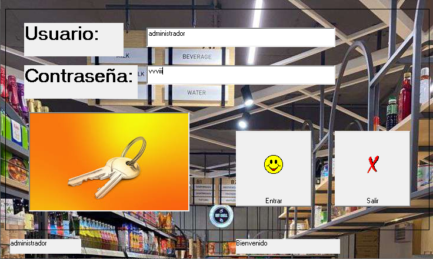
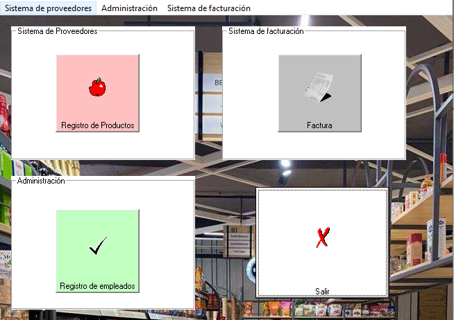
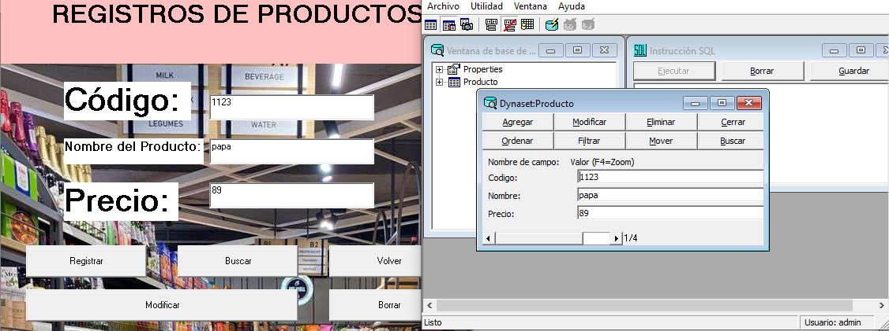
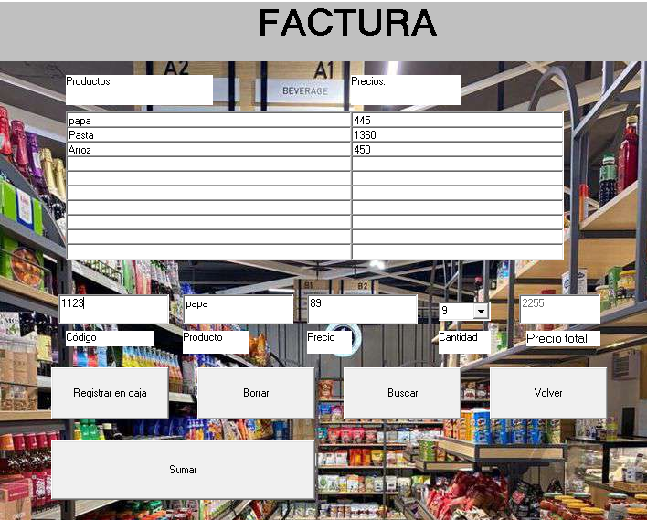

# Ejercicios e Interfaces / Proyecto de Facturación
Parte de Ejercicios del Liceo, el Proyecto de Facturación es un programa educativo diseñado en Visual Basic 6.0 para el aprendizaje de lógica de programación, manejo de formularios y sistemas de gestion de base de datos, caracterizandose por un manejo básico en la practica de todos estos conocimientos aprendidos en mi liceo.

## Capturas de Pantalla / Formularios:

Captura del sistema de Inicio de Sesión del Proyecto.

Captura del modulo de acceso a los demas formularios o Menú de acceso.

Demostración del modulo de Registro de Productos y su interfaz, Esta demostración incluye al lado una demostración en el Administrador visual de datos, en donde se guardan los datos ingresados en el modulo de Registro de Productos.

Demostración del Modulo de Facturación, las TextBox en la interfaz están simulando una serie de Arreglos para hacer una factura, esta interfaz tambien incluyen botones y campos para poder colocar datos, incluyendo un boton buscar para el autocompletado de datos los demás campos (Nombre y Precio) por medio del codigo del producto.

##  Características
* Interfaz clásica de Windows antiguos.
* Diseñado para la gestión de clientes y productos.
* Cálculo automático de impuestos y totales en la factura.
* Incluye documentación tecnica.
* Incluye autocompletado por medio de datos concretos en la creación de facturas

##  Tecnologías usadas

* **Entorno:** Windows 98/XP/10/11 (Compatibility Mode)
* **Recursos:** Iconos e imágenes incluidas
---
Proyecto desarrollado con fines educativos como parte de las actividades de Telemática en el Escuela Técnica José Laurencio correspondientes en el año escolar 2025 - 2026
